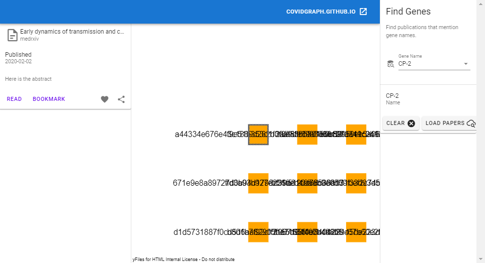

# Visual Graph Explorer (WIP)



This repository contains a sample application that can be used as a template to browse the 
"corona-graph". It is built using 


## See also

* [Learn more about yFiles](https://www.yworks.com/products/yfiles), the software library for visualizing, editing, and analyzing graphs

## How to run this app

You need a copy of the [yFiles for HTML](https://www.yworks.com/products/yfiles-for-html) diagramming library in order
to run this application. You can download a free test version of yFiles in the
[yWorks Customer Center](https://my.yworks.com/signup?product=YFILES_HTML_EVAL).

Checkout this project, then extract the yFiles for HTML package to some directory and run the initial steps in the
package for playing with the demos. This will also create an `npm` package file (using `npm pack` in the `lib\es-modules` directory).
That file needs to be placed top-level in this directory so that it can be installed via npm into the project.
Before you do that, also copy the `license.json` file from the yFiles package as `yfiles-license.json` and also drop it into this directory.


```
documents
 |-- visual-graph-explorer
     +-- yfiles-eval-22.0.3.tgz
     +-- yfiles-license.json
     +-- README.md
     +-- ...
```

Afterwards, run the usual commands
```
npm i
```
followed by
```
npm run serve
```
or
```
vue ui
```


## About

This application is powered by [yFiles for HTML](https://www.yworks.com/products/yfiles-for-html), the powerful
diagramming library.

Turn your data into clear diagrams with the help of unequaled automatic diagram layout, use rich visualizations for your
diagram elements, and give your users an intuitive interface for smooth interaction.

You can learn more about the many features that come with yFiles
on the [yFiles Features Overview](https://www.yworks.com/products/yfiles/features).

If you want to try it for yourself, obtain a free test version of yFiles in the
[yWorks Customer Center](https://my.yworks.com/signup?product=YFILES_HTML_EVAL).

## License
The MIT License (MIT)

Copyright (c) 2020 yWorks GmbH

Permission is hereby granted, free of charge, to any person obtaining a copy of this software and associated documentation files (the "Software"), to deal in the Software without restriction, including without limitation the rights to use, copy, modify, merge, publish, distribute, sublicense, and/or sell copies of the Software, and to permit persons to whom the Software is furnished to do so, subject to the following conditions:

The above copyright notice and this permission notice shall be included in all copies or substantial portions of the Software.

THE SOFTWARE IS PROVIDED "AS IS", WITHOUT WARRANTY OF ANY KIND, EXPRESS OR IMPLIED, INCLUDING BUT NOT LIMITED TO THE WARRANTIES OF MERCHANTABILITY, FITNESS FOR A PARTICULAR PURPOSE AND NONINFRINGEMENT. IN NO EVENT SHALL THE AUTHORS OR COPYRIGHT HOLDERS BE LIABLE FOR ANY CLAIM, DAMAGES OR OTHER LIABILITY, WHETHER IN AN ACTION OF CONTRACT, TORT OR OTHERWISE, ARISING FROM, OUT OF OR IN CONNECTION WITH THE SOFTWARE OR THE USE OR OTHER DEALINGS IN THE SOFTWARE.