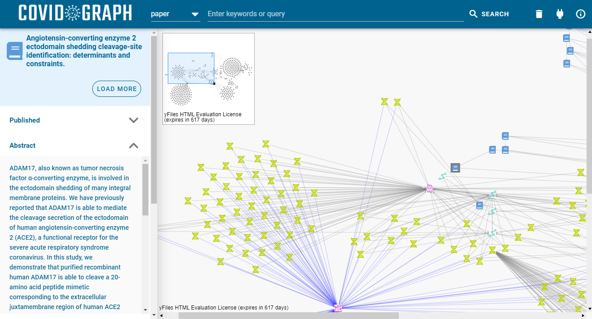

# Visual Graph Explorer

[](https://live.yworks.com/covidgraph)

Run the application here: https://live.yworks.com/covidgraph

This repository contains a sample application that can be used as a template to browse the
"covid-graph". See [https://covidgraph.org](https://covidgraph.org) for more information.

## Using the editor

Please see [the manual](./docs/vge-guidance.md) for a quick introduction on how to use the editor.

## See also

- [Learn more about yFiles](https://www.yworks.com/products/yfiles), the software library for visualizing, editing, and analyzing graphs

## How to run and develop this app as a software developer

You need a copy of the [yFiles for HTML](https://www.yworks.com/products/yfiles-for-html) diagramming library in order
to develop this application. You can download a free test version of yFiles in the
[yWorks Customer Center](https://my.yworks.com/signup?product=YFILES_HTML_EVAL). See [this introductory video on YouTube](https://www.youtube.com/watch?v=yzRAB-oP_uw) that will guide you through these steps.

Checkout this project, then extract the yFiles for HTML package zip to some directory. The library `lib-dev/yfiles-25.0.0+eval-dev.tgz` file needs to be placed top-level in the directory of this checkout next to this file so that it can be installed via `npm i` or `yarn` into this project.
Before you compile and run the project, also copy the `license.json` file from the yFiles package (find it at `lib\license.json` and also drop it into this directory as `yfiles-license.json`).

This is what your directory contents should look like:

```
documents
 |-- visual-graph-explorer
     +-- yfiles-25.0.0+eval-dev.tgz
     +-- yfiles-license.json
     +-- README.md
     +-- ...
```

Afterwards, run the usual commands

```
npm i
```

followed by

```
npm run serve
```

or if you prefer the visual UI from vue-cli

```
vue ui
```

## About

This application is powered by [yFiles for HTML](https://www.yworks.com/products/yfiles-for-html), the powerful
diagramming library. It was created as part of yWorks' [Fight Corona Program](https://www.yworks.com/support/fightcorona).

Turn your data into clear diagrams with the help of unequaled automatic diagram layout, use rich visualizations for your
diagram elements, and give your users an intuitive interface for smooth interaction.

You can learn more about the many features that come with yFiles
on the [yFiles Features Overview](https://www.yworks.com/products/yfiles/features).

If you want to try it for yourself, obtain a free test version of yFiles in the
[yWorks Customer Center](https://my.yworks.com/signup?product=YFILES_HTML_EVAL).

## License

The MIT License (MIT)

Copyright (c) 2020-2022 yWorks GmbH

Permission is hereby granted, free of charge, to any person obtaining a copy of this software and associated documentation files (the "Software"), to deal in the Software without restriction, including without limitation the rights to use, copy, modify, merge, publish, distribute, sublicense, and/or sell copies of the Software, and to permit persons to whom the Software is furnished to do so, subject to the following conditions:

The above copyright notice and this permission notice shall be included in all copies or substantial portions of the Software.

THE SOFTWARE IS PROVIDED "AS IS", WITHOUT WARRANTY OF ANY KIND, EXPRESS OR IMPLIED, INCLUDING BUT NOT LIMITED TO THE WARRANTIES OF MERCHANTABILITY, FITNESS FOR A PARTICULAR PURPOSE AND NONINFRINGEMENT. IN NO EVENT SHALL THE AUTHORS OR COPYRIGHT HOLDERS BE LIABLE FOR ANY CLAIM, DAMAGES OR OTHER LIABILITY, WHETHER IN AN ACTION OF CONTRACT, TORT OR OTHERWISE, ARISING FROM, OUT OF OR IN CONNECTION WITH THE SOFTWARE OR THE USE OR OTHER DEALINGS IN THE SOFTWARE.
